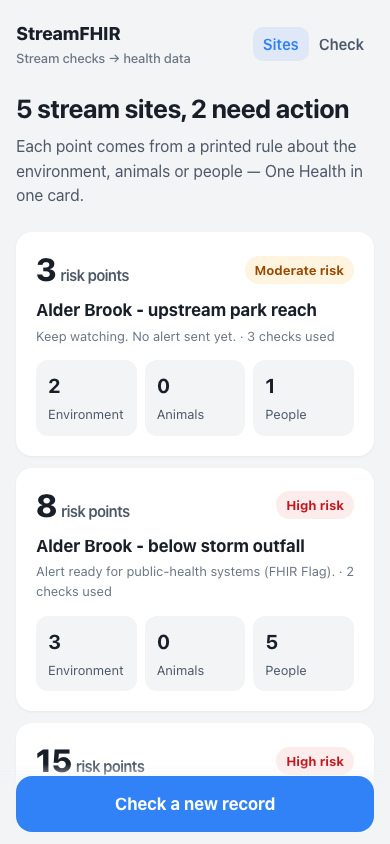
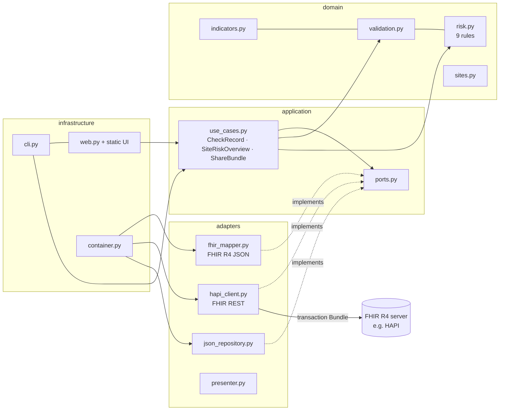

# StreamFHIR

**Citizen stream checks → HL7 FHIR R4 data + an explainable One Health risk flag that health systems can read.**

Built for the OneAquaHealth IEEE Global Hackathon 2026 (*Healthy Waters, Healthy Ecosystems, Healthy Communities*).



## Track alignment
**Track 7 — Digital Health Standards** ("Enable interoperability across systems — fragmented data and lack of standards — FHIR models, AI agents, and integration frameworks"), with a **Track 2** flavour: the output is an actionable One Health signal, not just a data format.

StreamFHIR is the bridge between a citizen-science stream observation and the systems that protect human, animal and environmental health. It speaks the standard those systems already use: HL7 FHIR R4.

## Problem
Citizens can now see and report what is happening in urban streams: sewage smell, green scum, dead fish, children paddling, dogs swimming. But those reports usually stay inside the app that collected them:

- **Fragmented data** — each citizen-science tool has its own format, so an environmental agency, a municipal dashboard and a public-health team cannot combine them without manual re-keying.
- **Trust gap** — a single citizen report may be wrong (a pH typo, a phone GPS 400 m off, a "dead fish" claim without a photo). Silent "cleaning" hides this; ignoring the report loses a real warning.
- **The One Health link is invisible** — a bloom at a pond where dogs swim is an animal-health *and* human-health issue, but water data and health data rarely meet.

## Solution
StreamFHIR is a small, runnable pipeline with a plain-language web UI:

1. **Ingest** a citizen stream assessment record (visual 1–10 habitat scores, test-strip readings, what you see/smell, who is in the water).
2. **Validate** it with human-in-the-loop rules: impossible values block sharing; unusual values, missing photos for big claims, poor GPS or a position far from the site are flagged *"Needs a quick look"* — **values are never altered**; they are shared as `preliminary` with a note.
3. **Map to HL7 FHIR R4**: `Location` (site, conditional create so a site is never duplicated), one `Observation` per indicator grouped by a panel `Observation`, `Media` for photos, `Provenance` for the pseudonymous observer and the software, all in one `transaction` Bundle. Published `CodeSystem`s, `ValueSet` and a minimal `StructureDefinition` profile.
4. **Explain risk per site** with 9 printed rules across three One Health lanes (environment · animals · people). No machine learning and no accuracy claims — every point on the card traces back to a rule and to the records that triggered it, with a *corroboration* check (≥2 independent observers or a photo).
5. **Emit a FHIR `Flag`** on the site `Location` when risk is high, so a public-health or environmental system can query or subscribe to it.
6. **Share** the Bundles to any FHIR R4 server. Dry run by default; live POST was tested against the public HAPI FHIR R4 server with synthetic data ([evidence](docs/evidence-hapi.md)).

## Target users
- **Citizen-science coordinators** who want their volunteers' observations to be reused by authorities.
- **Municipal environment and public-health teams** who already run (or procure) FHIR-capable systems and dashboards.
- **Researchers** combining citizen data with other One Health data sources.
- **Citizens** themselves, who see immediately whether their record is ready, needs a look, or cannot be shared yet — and why.

## Expected impact on ecosystem and human health
- **Earlier awareness**: a site-level Flag (e.g. "possible toxic algal bloom + dogs in the water") can reach a public-health system on the same day the observations arrive, instead of waiting in a separate app.
- **Better data quality without losing signals**: questionable reports are kept, labelled and routed to a person, not deleted or silently "fixed".
- **One Health made visible**: every site card shows environment, animal and human points side by side, so a water problem is framed as the shared health problem it is.
- **Reuse beyond one project**: because the output is standard FHIR, the same citizen record can feed several consumers (dashboards, surveillance systems, research repositories) without custom integrations.

These are expected impacts of the design; no field deployment or outcome measurement has been done.

## Run it (one command, Python 3.9+, no dependencies)
```bash
python3 -m streamfhir serve        # open http://127.0.0.1:8000
```
Other commands:
```bash
python3 -m streamfhir overview                 # risk level per site (terminal)
python3 -m streamfhir rules                    # print all 9 rules
python3 -m streamfhir check SYN-010            # validate + FHIR Bundle for one record
python3 -m streamfhir export                   # write all Bundles to ./out
python3 -m streamfhir send SYN-001             # dry run (default): nothing leaves your machine
python3 -m streamfhir send SYN-001 --live      # POST to https://hapi.fhir.org/baseR4 (synthetic data only)
python3 -m streamfhir validate-remote SYN-001  # ask the server to $validate a generated Observation
python3 -m pip install pytest && python3 -m pytest -q   # 45 tests, no network
```
Set `STREAMFHIR_FHIR_BASE` to target another FHIR R4 server. The web UI only ever does dry runs unless `STREAMFHIR_ALLOW_LIVE=1`.

## Architecture
Clean Architecture: dependencies point inwards; the domain knows nothing about FHIR, HTTP or files (enforced by `tests/test_architecture.py`).



## FHIR R4 mapping
| Source (citizen record) | FHIR R4 | Notes |
|---|---|---|
| `site_id`, site name, coordinates | `Location` (`identifier`, `name`, `position`, `mode=instance`) | `POST` with `ifNoneExist=identifier=…` → one Location per site, reused on every visit |
| One visit (`record_id`, `observed_at`) | panel `Observation` (code `stream-assessment`) with `hasMember` → indicator Observations | `category = observation-category#survey` |
| Visual score 1–10 (channel, banks, riparian zone, in-stream habitat) | `Observation.valueInteger` | codes from StreamFHIR `stream-indicator` CodeSystem |
| Readings (temperature, pH, nitrate, phosphate, transparency) | `Observation.valueQuantity` with UCUM (`Cel`, `[pH]`, `mg/L`, `cm`) | |
| Colour, surface film, odour, litter | `Observation.valueCodeableConcept` | codes from StreamFHIR `stream-answer` CodeSystem |
| Dead fish, people / animals in water | `Observation.valueBoolean` | |
| Photos | `Media` (`content.url`), referenced by `Observation.derivedFrom` | demo photo URLs are placeholders |
| Observer pseudonym | `Observation.performer` and `Provenance.agent[author].who` as a **logical reference by identifier only** | no name, e-mail or device ID |
| Software that built the Bundle | `Device` (conditional create) as `Provenance.agent[assembler]` and `Flag.author` | |
| Validation warnings | `Observation.status = preliminary` + `Observation.note` quoting the warning | `ok` records → `final`; `blocked` records are not exported |
| Synthetic / test data | `meta.security = v3-ActReason#HTEST` on every resource | |
| High site risk | `Flag` (`category = flag-category#safety`, `subject = Location`, `code` from `onehealth-risk`, `period.start`) | text lists fired rules and whether each is corroborated |

**Why `Flag` and not `DetectedIssue` or `RiskAssessment`?** In FHIR R4, `DetectedIssue.patient` and `RiskAssessment.subject` can only point to a Patient (or Group); `Flag.subject` can point to a `Location`, which is exactly "a warning about this place".

### Conformance resources (`fhir/`)
| File | What |
|---|---|
| `CodeSystem-stream-indicator.json` | 17 codes: panel + 16 indicators |
| `CodeSystem-stream-answer.json` | 16 answer codes for categorical indicators |
| `CodeSystem-onehealth-risk.json` | 3 risk levels + 9 rule codes (R1–R9) |
| `ValueSet-stream-indicator.json` | all indicator codes |
| `StructureDefinition-stream-assessment-observation.json` | minimal profile: `subject` 1..1 → Location, `category` 1..*, `code` required binding, `effectiveDateTime` 1..1, `performer` 1..1 |

**Terminology honesty:** all StreamFHIR codes live under the **example canonical `https://example.org/fhir/streamfhir/…`**. They are prototype codes, *not* LOINC or SNOMED CT codes; we did not use LOINC/SNOMED because we could not confirm genuine codes for these citizen indicators. The only external systems used are core HL7 terminology (`observation-category`, `provenance-participant-type`, `flag-category`, `v3-ActReason`, `v3-DataOperation`) and UCUM. A production version would map to LOINC/SNOMED CT where genuine codes exist and publish the rest in an Implementation Guide.

## One Health risk rules (printed, explainable)
Window: the 14 days before a site's latest check. Blocked records never count. **High** = 6+ points in total or 4+ points in one lane → a FHIR Flag is emitted. **Moderate** = 3–5. **Low** = 0–2. A rule is *corroborated* when supported by ≥2 distinct observers or ≥1 photo; otherwise the Flag text says "single report — verify".

| Rule | When | Points |
|---|---|---|
| R1 Poor habitat | mean of the 4 visual scores ≤ 5 | +2 environment |
| R2 Nutrient enrichment | nitrate ≥ 25 mg/L or phosphate ≥ 0.5 mg/L (demo thresholds) | +2 environment |
| R3 Possible toxic algal bloom | surface = algal-scum, or colour = green with water ≥ 20 °C | +3 animal, +2 human |
| R4 Sewage signal | odour = sewage or colour = milky-grey | +3 human, +1 environment |
| R5 Dead fish | dead fish seen | +3 animal, +1 environment |
| R6 People in contact with affected water | people in water while R3 or R4 fired | +2 human |
| R7 Pets/livestock in contact with affected water | animals in water while R3, R4 or R5 fired | +2 animal |
| R8 Oil or chemical signal | oily sheen or chemical odour | +2 environment, +1 human |
| R9 Nitrate above drinking-water value | nitrate ≥ 50 mg/L (EU drinking-water parametric value, used only as an awareness anchor) | +1 human |

Thresholds marked "demo" are starting points for a local team to tune, not regulatory limits. A visible scum is a reason to test, not proof of toxins.

## Data
- `data/sites.json` — 5 **synthetic** sites with fictional names; coordinates are illustrative and say nothing about any real stream.
- `data/assessments.json` — 14 **synthetic** records from 7 pseudonymous observers, including deliberate problems (pH typo, future date, missing observer, GPS 400 m off, dead fish without photo) to show validation.
- **Representative schema:** the record format is modelled on indicator families common in published citizen-science stream protocols (e.g. visual 1–10 habitat scoring as in the USDA NRCS *Stream Visual Assessment Protocol*, plus test-strip and transparency-tube readings). **It is not the official OneAquaHealth Citizen Science App schema**, which we could not inspect. Mapping another app's export into this record format is a small adapter.

Result on the sample data: 2 sites **high** (Flag emitted), 2 **moderate**, 1 **low**; record statuses: 7 ok, 4 needs review, 3 blocked.

## Evidence
- 45 automated tests (`pytest -q`), 0 network calls in tests.
- Live run against the public HAPI FHIR R4 server, synthetic data only: transaction accepted (HTTP 200, 21 resources), conditional create reused the existing Location on a second visit, generated Observations validate with **no issues** against the published StreamFHIR profile, and a deliberately broken Observation is rejected by the profile with 3 errors. Details and resource IDs: [docs/evidence-hapi.md](docs/evidence-hapi.md). (The public test server may purge data at any time.)
- Screenshots (390 px and 1280 px, no horizontal scroll): [docs/screenshots](docs/screenshots).

## Feasibility and scalability
- **Runs anywhere Python runs**; standard library only; stateless mapping, so it can sit behind any citizen-science app as a nightly export job or a webhook.
- **Integrates with existing systems through the standard**: any FHIR R4 server (HAPI, cloud healthcare FHIR stores, etc.) can store the Bundles; downstream dashboards can query `Flag?category=safety` or use FHIR `Subscription` on `Flag` (not implemented here).
- **Idempotent**: conditional create on site and software identifiers avoids duplicates when records are re-sent.
- **Next steps**: map one real citizen-science app export (e.g. the OneAquaHealth app, with the project's permission) into the record format; review rule thresholds with freshwater ecologists; replace example canonicals with a published Implementation Guide and genuine LOINC/SNOMED CT codes where they exist.

## Limitations
- Synthetic data only; no field test, no real users.
- The record schema is representative, not the official OneAquaHealth schema.
- Rules and thresholds are simple, hand-written and untuned; they are not validated against lab results and must not be read as a health advisory.
- Prototype codes under `example.org`; no LOINC/SNOMED CT mapping yet; profile is minimal (no slicing, no invariants).
- No authentication, no persistence layer, no FHIR Subscription; the web server binds to 127.0.0.1 and is for demo use.
- Photo URLs are placeholders; no image analysis.

## Project layout
```
SPEC.md                    purpose, numeric success criteria, Given/When/Then, non-goals
streamfhir/domain/         indicators, validation, risk rules (pure Python, no I/O)
streamfhir/application/    use cases + ports
streamfhir/adapters/       FHIR mapper, FHIR REST client, JSON repositories, presenter
streamfhir/infrastructure/ CLI, web server, static UI, composition root
fhir/                      CodeSystems, ValueSet, StructureDefinition
data/                      synthetic sites and records
docs/                      demo script, live evidence, screenshots
tests/                     45 tests
```

## License
MIT — see [LICENSE](LICENSE).
