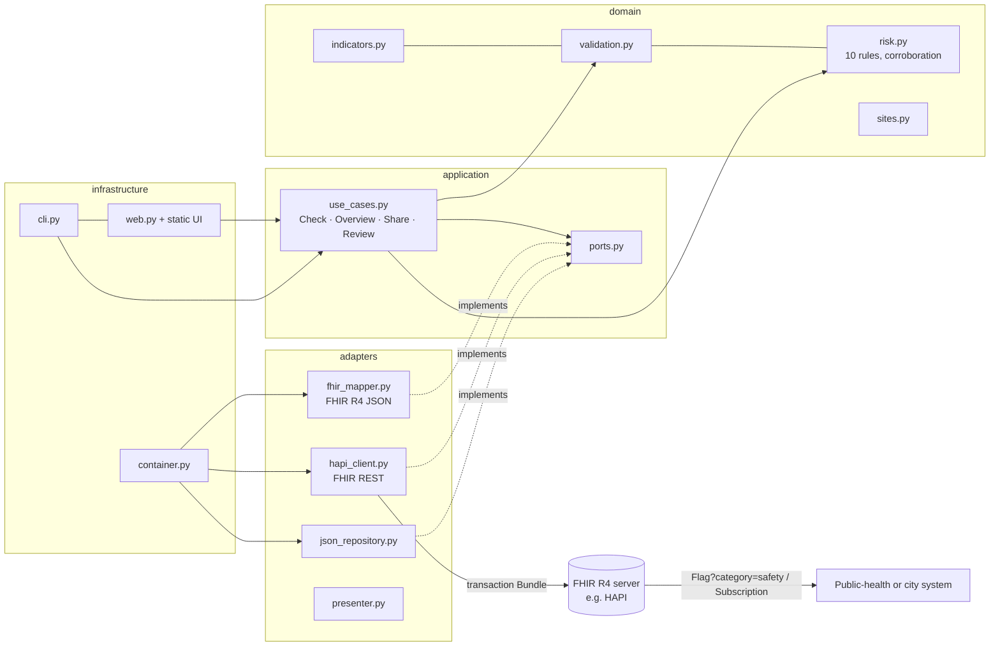

# StreamFHIR

**Citizen stream checks → HL7 FHIR R4 data + a One Health warning that health systems can read — raised only when the evidence is corroborated.**

Built for the OneAquaHealth IEEE Global Hackathon 2026 (*Healthy Waters, Healthy Ecosystems, Healthy Communities*). **Track 7 — Digital Health Standards.**

- **Live demo (no install):** https://ryugi62.github.io/streamfhir/demo/ — static page from [`docs/demo/`](docs/demo/); the sample records are precomputed.
- **Demo video (3:25):** https://youtu.be/xxEL--FC9tA
- **Run the full app:** `python3 -m streamfhir serve` → http://127.0.0.1:8000 (Python 3.9+, no dependencies).


## In 30 seconds
A volunteer at a pond sees green scum and dogs swimming. Today that report stays in one app. With StreamFHIR it becomes:
1. a **validated** record (impossible values blocked, doubtful ones flagged for a person — never silently changed),
2. **standard HL7 FHIR R4 data** (Location, Observations, Media, Provenance) that any FHIR server accepts, and
3. an **explainable site warning** (a FHIR `Flag` on the site) — but only when **corroborated** by two independent observers, a photo, or a reviewer. One unverified report asks for verification instead of raising an alarm.

## Track alignment
**Track 7 — Digital Health Standards** ("Enable interoperability across systems — fragmented data and lack of standards — FHIR models, AI agents, and integration frameworks"), with a **Track 2** flavour (actionable One Health insight).
StreamFHIR is a small **integration framework**: ports-and-adapters code where one adapter reads a citizen-science record and another writes FHIR R4 to any server. It ships **FHIR models** — 2 profiles, 4 CodeSystems, a ValueSet, a CapabilityStatement and a Subscription example — tested live on the public HAPI FHIR R4 server. We did not build an AI agent. The 10 rules are published as a CodeSystem (`onehealth-risk-rule`). In this version the Flag cites the rules that fired (for example R4, R6) in its narrative text; a coded rule extension on the Flag is the next step.

## Problem
- **Fragmented data** — every citizen-science tool has its own format. Environmental agencies, city dashboards and public-health teams cannot combine the data without re-keying it by hand.
- **The trust gap** — a single citizen report may be wrong: a pH typo, a GPS fix 400 m off, a dead-fish claim with no photo. Silently "cleaning" such reports hides the problem, and ignoring them loses real warnings. Raising alarms on them erodes trust.
- **The One Health link is invisible** — a bloom where dogs swim is an animal-health *and* a human-health issue, but water data and health data rarely meet.

## Solution
| Step | What StreamFHIR does |
|---|---|
| **Ingest** | A citizen assessment covers: visual 1–10 habitat scores, test-strip readings (with the nitrate basis, as NO3 or as N), a simple jar/stick bloom test, what the volunteer sees and smells, a mayfly/stonefly/caddisfly count with sampling time, and who is in the water. Entry is a step-by-step form (one question group per screen) or an app export. |
| **Validate** | Impossible values → *Can't share yet*. Unusual values, a missing photo for a big claim, poor GPS, a position far from the site, or a missing nitrate basis or sampling time → *Needs a quick look*. **Values are never altered.** Records needing a look are shared as `preliminary`, with the reason in a note. |
| **Review** | A reviewer can **Confirm** a report that needs a look, but only by giving a basis: *I visited*, *photo checked* or *lab result*. A reviewer can also **Reject** it. A confirmed report becomes `final`, and a Provenance `verifier` records the basis. A rejected report becomes `entered-in-error` and never counts. The site level updates immediately. On re-send the new status reaches the FHIR server (verified live: confirm → `final`, reject → `entered-in-error`). The live test also undid a reject by re-sending the record as `final`; a production system would issue a new version with an amendment note instead, because `entered-in-error` means the record should never have existed. |
| **Map to FHIR R4** | One transaction Bundle per visit: `Location` (site), a panel `Observation` with `hasMember` links to one `Observation` per indicator, `Media` (photos), a `Device` (the software) and a `Provenance` (pseudonymous author, assembler, optional verifier, source record). Sites and the software record use conditional create. Observations and Media use **conditional update by identifier**. So **re-sending never duplicates**, and review decisions propagate (both verified live). |
| **Explain** | 10 printed rules in two scores. **Health hazard** (6 rules, split into environment, animal and people lanes) is the only score that can raise a warning. **Ecological condition** (4 rules: habitat, nutrients, nitrate anchor, invertebrates) is tracked separately. Each rule shows why it fired, which reports support it, whether it is corroborated, and *what to do*. |
| **Warn** | A FHIR `Flag` (`category = safety`) on the site `Location` when **≥5 corroborated hazard points** fall in the 14 days up to the evaluation date. It links its trusted evidence with the core `flag-detail` extension, has its own Provenance, expires 14 days after the last trusted report, and is updated in place (conditional update by site). A hazard only clears after **2 trusted clear visits at least 7 days apart**, and those visits must have observed everything the rule depends on (scums move with the wind). `--stand-down` sets the site's Flag to `inactive` and keeps its original start. It does this only for sites that have an active Flag on the server. |
| **Share** | POST to any FHIR R4 server. Dry run is the default. Live sending was tested against `https://hapi.fhir.org/baseR4` with synthetic data ([evidence](docs/evidence-hapi.md)). |

## Target users
- **Citizen volunteers**, who see at once whether their record is ready, needs a look, or can't be shared yet — and why — plus plain advice ("keep dogs out of the water").
- **Citizen-science coordinators and data reviewers**, who confirm doubtful reports (with a stated basis) or reject them in one tap.
- **Municipal environment and public-health teams**, who receive standard FHIR warnings they can query (`Flag?category=safety&status=active`) or subscribe to.
- **Researchers**, who combine citizen data with other One Health data through a standard API.

## Expected impact on ecosystems and human health
- **Earlier, trusted awareness:** a corroborated warning (e.g. "possible cyanobacterial bloom + dogs in the water") can reach a public-health system as soon as the evidence exists, in a format it already reads.
- **Fewer false alarms and less lost signal:** doubtful reports are kept, labelled and routed to a person. They are never deleted, never silently "fixed", and never allowed to trigger a warning on their own.
- **One Health made visible:** every site shows environment, animal and people hazard side by side, with ecological condition beside them, so a water problem is framed as the shared health problem it is.
- **Reuse:** one citizen record can feed dashboards, surveillance systems and research repositories without custom integrations.

These are expected impacts of the design. No field deployment or outcome measurement has been done.

## How it could plug into OneAquaHealth (proposed, not integrated)
The OneAquaHealth project works in five research cities: Benevento, Coimbra, Ghent, Oslo and Toulouse (listed on oneaquahealth.eu). Its Hub offers a Citizen Science App, City Dashboards, a Resilience Map and GEOSSIP (hackathon education session 5). A possible fit, **not built or agreed with anyone**:

| Hub tool | StreamFHIR role |
|---|---|
| Citizen Science App | An input adapter maps the app's export into the StreamFHIR record, then validation, review and FHIR mapping run as shown here |
| City Dashboards | A dashboard reads `Flag?category=safety&status=active`, or receives pushes through the Subscription example |
| Resilience Map | Site `Location`s with their current hazard level and ecological condition |
| GEOSSIP | The FHIR API gives health-side systems the same site data the geo side sees |

## Run it
```bash
python3 -m streamfhir serve                     # web UI at http://127.0.0.1:8000 (dry run only)
python3 -m streamfhir overview                  # hazard level per site (terminal)
python3 -m streamfhir rules                     # all 10 rules with advice
python3 -m streamfhir check SYN-010             # validate + FHIR Bundle for one record
python3 -m streamfhir export                    # write all Bundles to ./out
python3 -m streamfhir send SYN-001              # dry run (default): nothing leaves your machine
python3 -m streamfhir send SYN-001 --live --flags   # POST to https://hapi.fhir.org/baseR4 (synthetic data only)
python3 -m streamfhir publish-conformance --live    # put CodeSystems, ValueSet and profiles on the server
python3 -m streamfhir validate-remote SYN-001 --with-profile   # server-side $validate against the profile
python3 -m streamfhir build-static              # rebuild the server-less demo in docs/demo
python3 -m streamfhir bench                     # throughput on your machine
python3 -m streamfhir send SYN-010 --live --review reject    # apply a reviewer decision, then send
python3 -m pip install pytest && python3 -m pytest -q     # 78 tests, no network
```
Set `STREAMFHIR_FHIR_BASE` to target another FHIR R4 server. The web UI only does dry runs unless `STREAMFHIR_ALLOW_LIVE=1`. The sample data is evaluated as of a fixed demo date (`demo_as_of` in `data/assessments.json`) so the demo never goes stale. Set `STREAMFHIR_REAL_CLOCK=1` to use today's date. A `Dockerfile` is included (`--host 0.0.0.0`). We have not built it, because no Docker was available on the development machine.

## Architecture
Clean Architecture: dependencies point inwards, and the domain knows nothing about FHIR, HTTP or files. `tests/test_architecture.py` enforces this, including relative imports.



## FHIR R4 mapping
| Source (citizen record) | FHIR R4 | Notes |
|---|---|---|
| `site_id`, name, coordinates | `Location` (`identifier`, `name`, `position`, `mode=instance`, `physicalType=area`) | conditional create → one Location per site |
| One visit | panel `Observation` (profile *StreamAssessmentPanel*: `hasMember` 1..*, no value) | open slice `category:survey = observation-category#survey` (1..1; partner categories allowed) |
| Visual scores 1–10, invertebrate count | `Observation.valueInteger` | profile *StreamIndicatorObservation*: value 1..1, no `hasMember` |
| Readings (temperature, pH, nitrate, phosphate, transparency, sampling minutes) | `valueQuantity` with UCUM (`Cel`, `[pH]`, `mg/L`, `cm`, `min`) | nitrate also carries **LOINC 9480-5** *Nitrate [Mass/volume] in Water*, but only when the reading is expressed as NO3 |
| Colour, surface, odour, litter, nitrate basis, bloom test | `valueCodeableConcept` from the `stream-answer` CodeSystem | |
| Dead fish, people or animals in the water | `valueBoolean` | |
| Photos | `Media` (`type = image`), referenced by `derivedFrom` from the panel and the visual-claim indicators only | demo photo URLs are placeholders |
| Observer pseudonym | `performer` and `Provenance.agent[author].who` as a logical reference by identifier | no name, e-mail or device ID; `meta.security` includes `PSEUDED` |
| Reviewer decision | `status` `final` / `entered-in-error` + `Provenance.agent[verifier]` (the display includes the basis) | sent as a conditional update, so the server copy changes too |
| Software | `Device`, as `Provenance.agent[assembler]` and `Flag.author` | |
| Test data | `meta.security`: `v3-ActReason#HTEST` and `v3-Confidentiality#U` on every resource | |
| Site warning | `Flag` (`category = flag-category#safety`, `subject = Location`, `code` from `onehealth-risk-level`, `period` start/end, `flag-detail` → evidence Observations) + `Provenance` | conditional update by `identifier = site`; `inactive` to stand down |

**Why `Flag` and not `DetectedIssue` or `RiskAssessment`?** In R4, `DetectedIssue.patient` and `RiskAssessment.subject` point to a Patient or Group. `Flag.subject` can point to a `Location`, which is exactly "a warning about this place".
**Why no `Reference.type` on the observer?** No R4 resource fits a pseudonymous citizen. `Practitioner` implies a care role, and `RelatedPerson` needs a Patient. An untyped logical reference is valid R4.
**Why logical, not conditional, references in `flag-detail`?** The evidence Observations may not exist yet on the receiving server: they may be sent later, or to another server. A conditional reference would then fail the whole transaction. A logical reference by identifier resolves with `Observation?identifier=…`.

### Conformance resources (`fhir/`)
| File | What |
|---|---|
| `CodeSystem-stream-indicator.json` | 21 codes: panel + 20 indicators (`valueSet` declared) |
| `CodeSystem-stream-answer.json` | 21 answer codes |
| `CodeSystem-onehealth-risk-level.json` | 4 levels: high, verify, moderate, low |
| `CodeSystem-onehealth-risk-rule.json` | 10 rules with condition, reason and advice |
| `ValueSet-stream-indicator.json` | all indicator codes |
| `StructureDefinition-stream-assessment-panel.json` | panel profile |
| `StructureDefinition-stream-indicator-observation.json` | indicator profile |
| `CapabilityStatement-streamfhir-client-requirements.json` | what a receiving server must support (`kind = requirements`) |
| `Subscription-example-safety-flags.json` | R4 rest-hook subscription on safety Flags (example endpoint) |

**Terminology honesty.** All StreamFHIR codes live under the **example canonical `https://example.org/fhir/streamfhir/…`**. They are prototype codes, not LOINC or SNOMED CT. The one LOINC code used (9480-5) was confirmed with `$lookup` on tx.fhir.org (LOINC 2.82). We did not add LOINC or SNOMED codes for the other indicators because we could not confirm a matching code for citizen visual or test-strip observations. A production version would search further, move to a canonical URL it controls, and publish an Implementation Guide.

## Rules (printed, explainable)
**Health hazard** can raise a Flag. **Ecological condition** never raises a Flag on its own.

| Rule | Kind | When | Points |
|---|---|---|---|
| R1 Poor habitat | condition | mean visual habitat score ≤ 5 (flowing sites only) | +2 condition |
| R2 Nutrient enrichment | condition | nitrate ≥ 25 mg/L as NO3 or phosphate ≥ 0.5 mg/L (demo thresholds) | +2 condition |
| R3 Possible cyanobacterial bloom | hazard | algal scum, or green water ≥ 20 °C — *not* if the jar/stick test points to green or filamentous algae | +3 animal, +2 people |
| R4 Sewage signal | hazard | sewage odour or milky-grey water | +3 people, +1 env |
| R5 Dead fish | hazard | dead fish seen | +3 animal, +1 env |
| R6 People in contact with affected water | hazard | people in the water while R3 or R4 fired | +2 people |
| R7 Pets or livestock in contact with affected water | hazard | animals in the water while R3, R4 or R5 fired | +2 animal |
| R8 Oil or chemical signal | hazard | oily sheen or chemical odour | +2 env, +1 people |
| R9 Nitrate above drinking-water value | condition | nitrate ≥ 50 mg/L as NO3 (EU drinking-water parametric value, used only as an awareness anchor) | +1 condition |
| R10 No mayfly, stonefly or caddisfly larvae | condition | count 0 after ≥ 1 min kick-net sampling (flowing sites only; a coarse screen, not a biotic index) | +2 condition |

- **Levels:** *High* = ≥ 5 **corroborated** hazard points (a Flag is raised). *Needs verification* = ≥ 5 hazard points, not yet corroborated. *Moderate* = 2–4. *Low* = 0–1.
- **Corroborated:** a signal is supported by trusted reports. A trusted report has status ok, or a reviewer confirmed it and stated the basis. The signal counts as corroborated in any of these cases:
  - trusted reports come from ≥ 2 independent observers;
  - a trusted report has a photo attached;
  - a reviewer confirmed it.

  Photos are not analysed; a reviewer is expected to look at them.
- **Clearing:** a hazard clears only after 2 trusted visits ≥ 7 days apart that observed all the rule's inputs and did not see the signal. A condition rule clears after 1 such visit.
- **Still water:** stream methods (R1 habitat scoring and R10 kick-net sampling) are skipped at still-water sites such as ponds.
- Thresholds marked "demo" are starting points for a local team to tune, not regulatory limits. A scum is a reason to test, not proof of toxins.

## Data
- `data/sites.json`: 5 **synthetic** sites (4 flowing, 1 still water). Names are fictional and the coordinates are illustrative.
- `data/assessments.json`: 15 **synthetic** records from 7 pseudonymous observers. They include deliberate problems: a pH typo, a future date, a missing observer, a GPS fix 400 m off, and dead fish or scum reported without a photo.
- **Representative schema:** indicator families are modelled on published citizen-science stream protocols. The habitat scoring is a 4-element subset in the style of the USDA NRCS *Stream Visual Assessment Protocol*; for European use, the River Habitat Survey is a natural next step. There are also test-strip and transparency-tube readings, jar/stick bloom tests, and an EPT presence screen. **This is not the official OneAquaHealth Citizen Science App schema**, which we could not inspect. Mapping another app's export into this format takes one input adapter.

Sample result (demo date 29 Sep 2026):
- **Records:** 7 ok, 5 need a look, 3 blocked.
- **Sites:** 2 **High** (Flag raised), 1 **Needs verification**, 1 Moderate, 1 Low.
- **Demo moment:** confirming report SYN-015 at Willow Creek ("I visited") turns *Needs verification* into *High* and raises the Flag. Undo returns it. This also works in the static demo, which replays precomputed single decisions.

## Evidence
- **78 automated tests** (`pytest -q`), 0 network calls. They include an architecture test, static UI checks, and acceptance tests AC-1 to AC-31 (see `SPEC.md`).
- **Live on the public HAPI FHIR R4 server, synthetic data only** ([details and IDs](docs/evidence-hapi.md); the server may purge data at any time):
  - Transactions are accepted.
  - Re-sending the same record creates **0 duplicates**, and Flags update in place.
  - Reviewer decisions reach the server: the same Observation goes from `preliminary` to `entered-in-error` to `final`.
  - Stand-down only touches Flags that are active on the server.
  - Generated indicator and panel Observations and a Flag validate with **no issues** against the published profiles.
  - Broken resources are rejected by the profile.
- **Real public data run (not citizen science):** `import-wqp` converts a snapshot of the **US Water Quality Portal** into StreamFHIR records. The source is Maryland and DC streams, September 2025, retrieved 2026-09-29 without an account; the query is in `data/real-wqp/SOURCE.txt`. The query asked for pH, water temperature and nitrate; the snapshot contains 81 pH and 80 temperature rows and **0 nitrate rows**. The result, using the same pipeline:
  - 161 source rows → **63 sampling visits at 45 real stations**, 126 values mapped.
  - **41 ready / 22 needing a look**, for three reasons: 18 pH and 17 temperature duplicates within one visit (the first value is kept and noted), and **4 pH values that the source labels with the unit "Molar"**. That unit error in the source is surfaced for a person, not silently fixed.
  - 378 FHIR resources.
  - A real pH Observation validates with no issues against the profile on HAPI (not stored).
  - **What this run does not prove:** agency chemistry data contains none of the citizen observations the risk rules score (scum, smell, dead fish, people or animals in the water). All 45 real sites are therefore shown as **"Not assessed"**, not "Low". The run tests ingest, validation and FHIR mapping on real data, not the risk rules.

  Real data is not tagged `HTEST`, and organisation ids are not marked pseudonymised. Commands: `python3 -m streamfhir import-wqp`, then `python3 -m streamfhir --data data/real-wqp serve` (screenshots 8 and 9).
- **Throughput:** about 5,200 records/s validated and mapped on one laptop core (`python3 -m streamfhir bench`, 3,000 records).
- **Screenshots** at 390 px and 1280 px, no horizontal scroll: [docs/screenshots](docs/screenshots).

## Feasibility and scalability
- **Runs anywhere Python runs:** standard library only, and stateless mapping. It can sit behind any citizen-science app as a nightly export job or a webhook.
- **Integrates through the standard:** any FHIR R4 server can store the Bundles (see the CapabilityStatement for what it must support). Downstream systems query or subscribe to `Flag`.
- **Safe to re-run:** conditional create and conditional update make re-sending idempotent (measured, see the evidence).
- **Pilot shape (proposal only):** a coordinator exports a week of app records, runs `export` or `send` against a FHIR test server, and a reviewer uses the Confirm/Reject screen. Everything runs remotely at zero cost, and no one has to travel.

## Limitations
- Demo data is synthetic. The one real run uses US agency monitoring data (chemistry only), not European citizen-science data. There has been no field test and there are no real users.
- The record schema is representative, not the official OneAquaHealth schema.
- The rules and thresholds are simple, hand-written and untuned. They have not been validated against lab results and must not be read as a health advisory.
- Only one LOINC code is used. The other codes are prototype codes under `example.org`. The profiles are small differentials, validated with the HAPI server's validator rather than the official IG Publisher.
- There is no authentication or persistence. Reviewer decisions live in memory and are shared by everyone using the same server. They are lost on restart, and the reviewer identity is a placeholder (`reviewer-demo`).
- The Subscription is an example resource and was not exercised end to end. Showing a notification would need a publicly reachable webhook receiver, or a local FHIR server; this prototype has neither (no hosting, and no Docker/Java on the build machine).
- Photo URLs are placeholders, and there is no image analysis. A photo counts as corroboration because it is kept for a reviewer to audit, which means a single photo-backed report can raise a Flag before a reviewer has looked at it. A production version should require a reviewer to check the photo first.
- The Flag and Location are validated against base R4 only; the two profiles cover the Observations. A Flag profile is next.
- There is no write-side security. Production writes to a public-health FHIR server would use SMART Backend Services (client-credentials JWT) and an agreed Consent/Provenance policy; none of this is implemented.
- The synthetic sites are placed around Coimbra (a OneAquaHealth research city) for illustration only. Their names and conditions are fictional.
- Known false-positive risks: a natural iron-bacteria film can look like an oily sheen (R8; a natural film breaks into plates when touched with a stick, oil swirls back together), and the 20 °C line in R3 does not suit cooler cities such as Oslo or Ghent. Thresholds would be set per city.
- The static demo replays precomputed sample checks and single reviewer decisions. Checking your own record needs the local server.
- Invertebrates are a coarse screen of three groups, not a biotic index. A published scheme such as the Riverfly ARMI would need its method text and local calibration; both are next steps.

## Project layout
```
SPEC.md                    purpose, numeric success criteria, Given/When/Then, non-goals
streamfhir/domain/         indicators, validation, rules and corroboration (pure Python, no I/O)
streamfhir/application/    use cases + ports
streamfhir/adapters/       FHIR mapper, FHIR REST client, JSON repositories, presenter
streamfhir/infrastructure/ CLI, web server, static UI, composition root
fhir/                      CodeSystems, ValueSet, profiles, CapabilityStatement, Subscription example
data/                      synthetic sites and records; data/real-wqp: real WQP snapshot + imported dataset
docs/                      static demo, demo script, live evidence, screenshots
tests/                     78 tests
```

## License
MIT — see [LICENSE](LICENSE).
